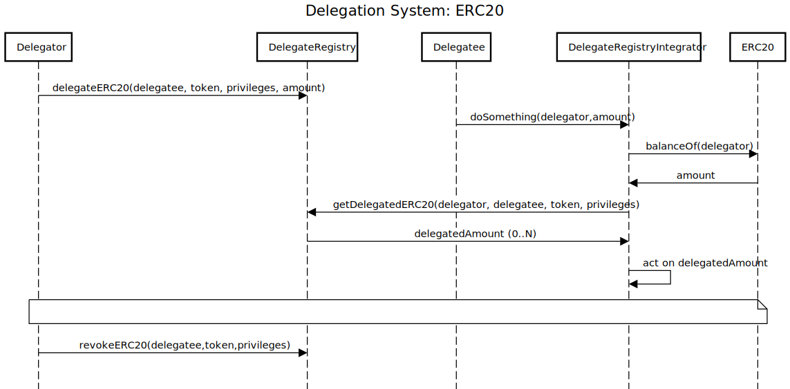
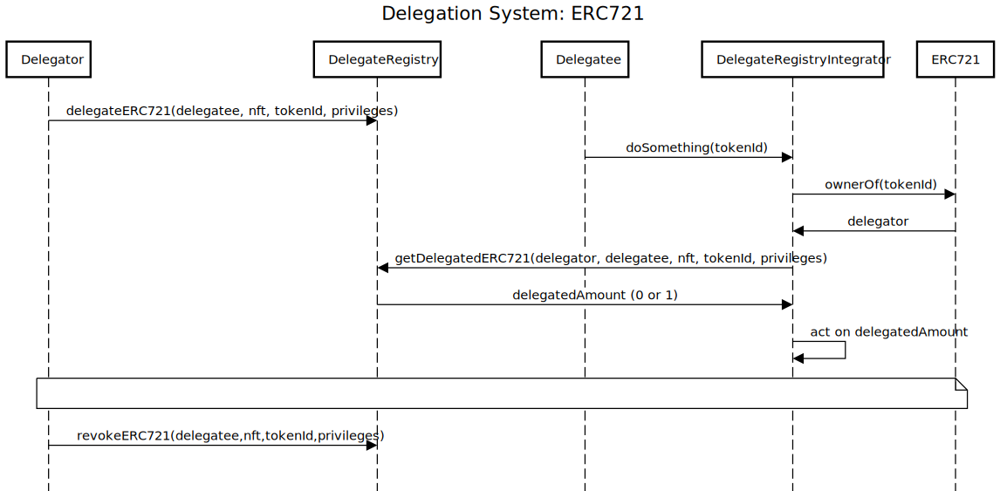

# Asset Delegation System

## Implementation Approach

### Considered Strategies

These are the strategies considered for this task given the core requirements:

1. NFT contract extension.
2. NFT Wrapper or Escrow.
3. Account Abstraction (ERC-4337).
4. Contract registry.

#### 1. NFT Contract Extension

A contract extension for the ERC-721 standard that maps delegators with delegatees. Discarded due to:

- Frictions:
  - Can't be used by existing NFTs.
  - Adoption by 3rd parties.
  - Lack of standardisation. Besides, it may not be compatible with NFTs that don't use NFT contracts from standard
    libraries (e.g. OpenZeppelin, solmate, solady) or that don't follow 100% the ERC-721 standard.
  - Bloats NFT code.
  - Scalability. Each new ERC token or blockchain asset will require a new implementation.
- Risks:
  - Bugs that affect the normal NFT functionality.

#### 2. NFT Wrapper or Escrow

A contract that extends the received ERC-721 functionality. Discarde due to:

- Frictions:
  - Transferring the NFT ownership to a contract (which is almost hard no-no requirement). It would require to be
    permisionless (and of course not upgradeable).
  - Breaks backward compatibility. The WNFT has a new address which breaks dApps (both off-chain and on-chain) and web
    services.
  - Scalability. Each new ERC token or blockchain asset will require a new implementation.
- Risks:
  - Breaks backward compatibility. The WNFT has a new address which may create attack vectors on dApps.
  - Inability to unwrap; NFT locked.

#### 3. Account Abstraction (ERC-4337)

Somehow using ERC-4337 to delegate an ERC-721 without transferring its ownership. Discarded due to it is not clear to me
now how Account Abstraction would solve or help on this.

#### 4. Contract Registry

A permissionless contract that maps ERC-721 delegators with delegatees. Chosen option due to:

- Frictions:
  - Standardisation and adoption. The implementation may not be the cup of tea of other developers.
- Risks:
  - NA.
- Pros:
  - Permissionless and safe for any NFT. A standalone contract that acts as a registry and does not interact with any
    NFT. It has no ownership, no access controls and it is not upgradeable.
  - Backwards compatible. Can be used by existing NFTs.
  - Scalable and extensible. The design can be extended to other token standards (e.g. ERC20, ERC721A, ERC1155) and
    blockchain assets (any address can delegate anything to another address). It can also be easily deployed to other
    EVMs (as long as the target chain has the opcodes and precompiles needed).

In fact there is already a delegation system called
[delegate-registry](https://github.com/delegatexyz/delegate-registry) (which contracts have been authored by foobar and
mireynolds) that follows this approach and not only allows to delegate ERC-721 but also other standards and addresses.

### Design

#### Use Cases

From a Delegator (EOA or CA) point of view:

- Case ERC721:
  - I should be able to delegate a NFT token to a Delegatee.
- Case ERC20:
  - I should be able to delegate a TKN token amount to a Delegatee.
- Case general:
  - I should be able to revoke the delegation anytime.
  - I should be able to get the data of my delegations.

From a Delegatee (EOA or CA) point of view:

- Case general:
  - I should be able to get the data of the delegations I'm involved with.

From a On-chain Integrator (CA) point of view:

- Case ERC721:
  - I should be able to check whether a NFT token has been delegated from a Delegator to a Delegatee.
- Case ERC20:
  - I should be able to check whether a TKN amount has been delegated from a Delegator to a Delegatee.

From an Off-chain Integrator (e.g. web front, web service/API) point of view:

- Case ERC721:

  - I should be able to check whether a NFT token has been delegated from a Delegator to a Delegatee.

- Case ERC20:

  - I should be able to check whether a TKN amount has been delegated from a Delegator to a Delegatee.

- Case general:
  - I should be able to get all the up-to-date delegation data for a given Delegator address (this is gas intensive to
    perform on-chain).
  - I should be able to get all the up-to-date delegation data for a given Delegatee address (this is gas intensive to
    perform on-chain).

#### Other Features

Permission-based delegation: enable a permission-based delegation mechanism (aka. privileges). A Delegator delegates an
asset to a Delegatee with certain privileges. Then, it is up to integrators to use them on/off-chain.

Time-based delegation (feature not added): enable a delegation mechanism with a specific timeframe (aka. deadline). A
Delegator delegates an asset to a Delegatee for an indefinite duration or until a predetermined deadline is reached.
Then, it is up to the integrators to use them on/off-chain.

### Implementation

[`DelegateRegistry.sol`](./src/protocol/registry/DelegateRegistry.sol) is the only contract and these are its
highlights:

- Stores each [`Delegation`](./src/protocol/libraries/DataTypes.sol) data by a unique key (composite key) that defines
  it. The key (`bytes32:delegationKey`) is is asset-dependant (e.g. ERC20, ERC721) and is generated as follows:
  - ERC20:
    `keccak256(abi.encodePacked(address:delegator, address:delegatee, address:erc20, uint8:DelegationType, bytes32:privileges))`.
  - ERC721:
    `keccak256(abi.encodePacked(address:delegator, address:delegatee, address:erc721, uint8:DelegationType, uint256: tokenId, bytes32:privileges))`.
  - **BEWARE**: For the given parameters (all fixed-size) there shouldn't be a hash collision within a given asset type
    (e.g. two different ERC20 delegations with the same key) and neither cross asset types (a.g. an ERC20 delegation and
    an ERC721 delegation with the same key). The `uint8:DelegtionType` data is added as an extra into the mix to prevent
    any possible ambiguity.
  - **BEWARE**: The `keccak256` opcode is widely supported accross EVM networks and it also behaves as expected.
- The [`Delegation`](./src/protocol/libraries/DataTypes.sol) data structure could be a smaller tuple (i.e.
  `[uint256:delegatedAmount,uint256:deadline]`) or just a `uint256:delegatedAmount`. However, it contains multiple data
  already present in the `delegationKey` (e.g. addresses). This definitely increases the cost of setting and revoking a
  delegation on-chain, but lowers the friction of off-chain integrations; not all integrators have all the data to
  construct a key.
- The data type chosen for `privileges` is `bytes32` to provide enough flexibility. It can be converted to other data
  types (e.g. `bool`, `uint256`, `string`) or be used as a bitmap.
- The delegated amount (from `Delegation.amount`) for an ERC721 is always be 1.
- Mappings:
  - `s_delegationKeyToDelegation`: maps a `delegationKey` to a `Delegation`. It stores delegation data for all the
    supported standards in the registry (i.e. ERC20, ERC721).
  - `s_delegatorToDelegationKeys`: maps a Delegator address to an iterable mapping of `delegationKey`. It improves the
    discoverability of delegations set up by a Delegator address. The array of `Delegation` is updated each time a
    delegation is either created or revoked by the Delegator.
  - `s_delegateeToDelegationKeys`: maps a Delegatee address to an iterable mapping of `delegationKey`. It improves the
    discoverability of delegations set up for a Delegatee address. The array of `Delegation` is updated each time a
    delegation is either created or revoked for the Delegatee.
- Delegating (either a NFT or a TKN) does not require that the Delegator owns the NFT or has TKN balance (neither
  anytime soon, nor ever).

Few interfaces are provided:

- [`IDelegateRegistryRead.sol`](./src/interfaces/IDelegateRegistryRead.sol): declares getters and helper functions to be
  used both on-chain and off-chain.
- [`IDelegateRegistryWrite.sol`](./src/interfaces/IDelegateRegistryWrite.sol): declares the functions that make state
  changes in `DelegateRegistry` (i.e. delegate and revoke functions). It also declares their respective events.
- [`IDelegateRegistry.sol`](./src/interfaces/IDelegateRegistry.sol): an interface that combines `IDelegateRegistryRead`
  and `IDelegateRegistryWrite`.
- [`ITypeAndVersion.sol`](./src/interfaces/ITypeAndVersion.sol): declares getter for the current `DelegateRegistry`
  version.

Deployment scripts:

- [`DeployDelegateRegistry.s.sol`](./script/DeployDelegateRegistry.s.sol): a script that uses `CREATE2` to deploy
  `DelegateRegistry` in order to have consistent adresses across networks. First, make sure that the target network
  opcodes (e.g. `CREATE2`, `KECCAK256`) behave as expected.

#### DelegateRegistry.sol

### DelegateRegistry Integration

#### ERC20

Legend:

- `ERC20`: a TKN contract.
- `Delegator`: an EOA or CA that has TKN balance.
- `Delegatee`: an EOA or CA that Delegator delegated to a TKN amount.
- `DelegateRegistry`: a CA that stores ERC20 delegation data.
- `DelegateRegistryIntegrator`: a CA that interacts with `DelegateRegistry` upon Delegate calls to it.



Delegation process:

1. Delegator (ideally has TKN balance but it is not compulsory) calls `DelegateRegistry.delegateERC20()` to delegate a
   TKN amount to a Delegatee with certain privileges.
2. Delegatee interacts with an external contract by calling `DelegateRegistryIntegrator.doSomething()`.
3. Upon the Delegatee call, `DelegateRegistryIntegrator` checks:
   - The TKN amount Delegator owns (by calling `ERC20.balanceOf()`).
   - The delegated TKN amount from Delegator to Delegatee (by calling `DelegateRegistry.getDelegatedERC20()`).
4. Finally, `DelegateRegistryIntegrator.doSomething()` logic acts according the collected data (e.g. proceed with the
   execution, revert, trigger certain logic).
5. Delegator can revoke the ERC20 delegation any time.

#### ERC721

Legend:

- `ERC721`: a NFT contract.
- `Delegator`: an EOA or CA that has a NFT token.
- `Delegatee`: an EOA or CA that Delegator delegated to a NFT token.
- `DelegateRegistry`: a CA that stores ERC721 delegation data.
- `DelegateRegistryIntegrator`: a CA that interacts with `DelegateRegistry` upon Delegate calls to it.



Delegation process:

1. Delegator (ideally owns a NFT token but it is not compulsory) calls `DelegateRegistry.delegateERC721()` to delegate a
   NFT token to a Delegatee with certain privileges.
2. Delegatee interacts with an external contract by calling `DelegateRegistryIntegrator.doSomething()`.
3. Upon the Delegatee call, `DelegateRegistryIntegrator` checks:
   - The NFT token Delegator owns (by calling `ERC721.ownerOf()`).
   - The delegated NFT token from Delegator to Delegatee (by calling `DelegateRegistry.getDelegatedERC721()`).
4. Finally, `DelegateRegistryIntegrator.doSomething()` logic acts according the collected data (e.g. proceed with the
   execution, revert, trigger certain logic).
5. Delegator can revoke the ERC721 delegation any time.

### What's next

These are the next steps that should be addressed:

- Discuss the current implementation, whether or not ticks all requirements and a act accordingly, for instance:
  - Extend or replace `Delegation` struct.
  - Add or remove `address to bytes32` maps.
  - Replace the `bytes32 privileges` with another data type and/or format.
  - Add a `uint256 deadline` to `Delegation`.
  - Define different external methods.
  - Do not revert when the function side effects won't modify the current state.
- Profile the current implementation and seek for gas optimisations, especially the storage-related ones (read and
  write).
- Support other well-known ERCs, for instance ERC1155 and just contract addresses.
- Improve the existingtest suite with integration and user cases tests, and better fuzzing.
- Improve deployment script. Find vulnerabilities/improvements on the `CREATE2` strategy.
- Improve NatSpec.

## Usage

### Install Repo Dependencies

1. Install [bun](https://bun.sh/package-manager), a Node.js package manager alternative to Foundry git submodules.
2. Optionally install [bulloak](https://github.com/alexfertel/bulloak), a Solidity test generator based on the Branching
   Test Technique (BTT).

### Setup Repo

Build the contracts:

```sh
$ forge build
```

### Test Repo

Run all tests:

```sh
$ forge test
```

Get a test coverage report:

```sh
$ forge coverage
```

Get a gas report:

```sh
$ forge test --gas-report
```

Generate a test scaffold with bulloak:

```sh
$ bulloak scaffold test/unit/concrete/registry/DelegateRegistry.tree

$ bulloak scaffold test/unit/concrete/script/DeployDelegateRegistry.tree
```

### Deploy Contract

#### Anvil

Simulate deployment on Anvil (it requires first to run Anvil on the terminal):

```sh
forge script script/DeployDelegateRegistry.s.sol --broadcast --fork-url http://localhost:8545
```
